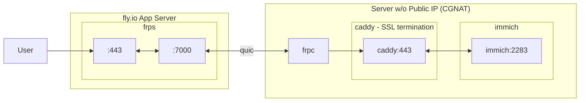

# immich - using fly.io, frp, and caddy

[immich](https://github.com/immich-app/immich/) using [Fast reverse proxy](https://github.com/fatedier/frp) and [caddy](https://caddyserver.com) on [fly.io](https://fly.io),

Behind CGNAT with no public ip? Or prefer to keep your home IP private? 

Here’s an Immich setup that exposes your instance to the internet **without revealing your IP address** (or if you lack a public IP). It uses **FRP (Fast Reverse Proxy)** as a tunnel, **Fly.io** as the public-facing endpoint, and **Caddy** as a reverse proxy inside the Docker container to route requests to Immich—or any other self-hosted apps you're running.

## Deploying to fly.io

**Requirements:** [flyctl](https://github.com/superfly/flyctl)

1. Check the `frp` version in the Dockerfile; update if not the latest.
2. Create a new Fly app:
   `fly launch --copy-config --name your-name --no-deploy`
3. Choose the nearest region.
4. Set secrets:
   `fly secrets set FRP_TOKEN=12345678 FRP_USERNAME=admin FRP_PASSWORD=changeme FRP_SUBDOMAIN_HOST=example.com`
5. Deploy:
   `fly deploy`

Access the FRP dashboard at:
**[https://your-name.fly.dev](https://your-name.fly.dev)**

## Updating configuration

Type `fly deploy` on the repository after editing `frps.toml`
